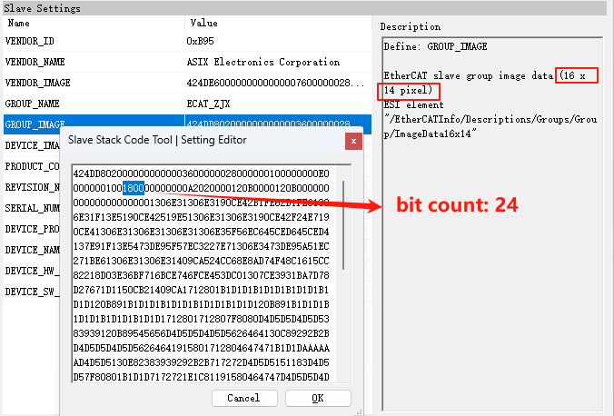
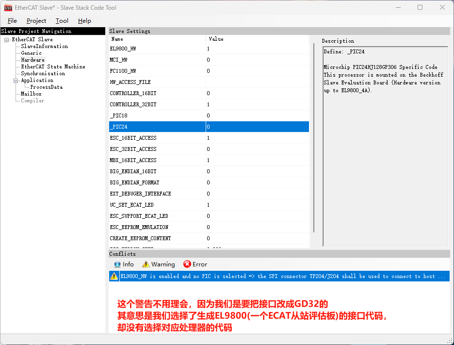
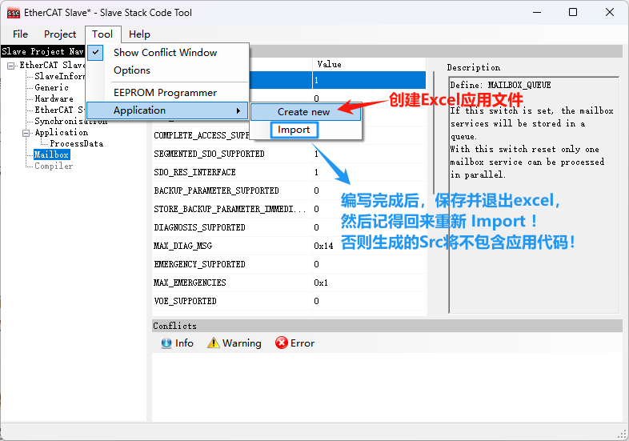

### 简介

移植平台GD32C113，从站芯片AX58100，EtherCAT Slave Stack Code Tool (SSC) V5.12 注意：如果安装了SSC5.11，还可以正常安装SSC5.12；如果安装了SSC5.12，想再装SSC5.11，需要先将5.12卸载干净。

## SSC Tool使用

### 1、新建工程

如上图所示，有两个选项，**Default**和**Custom**。这个两个选项其实没有太大的区别，可以理解为Default需要我们自己来进行一些配置，Custom是提供好几个配置模板。这里我选择了Default。

### 2、配置选项

配置选项右侧有description说明每个参数的意思，写的很详细，不懂的可以参考。

#### SlaveInformation

这个选项是配置从站的一些设备信息。

VENDOR是指从站使用的芯片的供应商，VENDOR\_ID是倍福提供的，我用的是AX58100，所以填的是亚信的ID。

IMAGE是供应商、团队等的logo图标，分析示例的信息头可知logo是16x14、24位的bmp图片。

DEVICE是指从站。

#### Generic

保持默认即可

#### Hardware

| Name             | Value | 说明                                                         |
| ---------------- | ----- | ------------------------------------------------------------ |
| EL9800_HW        | 1     | 这个选项置1后会生成EL9800(ESC芯片)的硬件接口文档，我们可以在这个文档的基础进行修改，改成我们GD32的 |
| _PIC18           | 0     | EL9800从机评估板                                             |
| _PIC24           | 0     | EL9800从机评估板                                             |
| ESC_16BIT_ACCESS | 1     | 通常 2 字节对齐，原因见下                                    |
| ESC_32BIT_ACCESS | 0     | 原因见下                                                     |
| MBX_16BIT_ACCESS | 1     | 原因见下                                                     |

**大多数 EtherCAT 从站在 PDO 映射时 要求数据按 2 字节（16 位）对齐**（本地邮箱也是）

#### Application

所有应用模板全部设成0，因为后面将自己填写excel应用文件。

Application_FILE 也不需要填，因为这个只有在没有添加excel应用文件才会有效，就是告诉SSC应用文件的头文件名字叫什么。

不使用默认main。

#### Mailbox

只使能CoE（CANopen over EtherCAT）就可以。

### 3、创建excel应用文件

### 4、编写excel应用文件

### 5、生成从站源码

记得先把刚刚编写完成的excel导入到SSC配置工程，在点击“Project”、“Create new Slave Files”，生成从站源码。