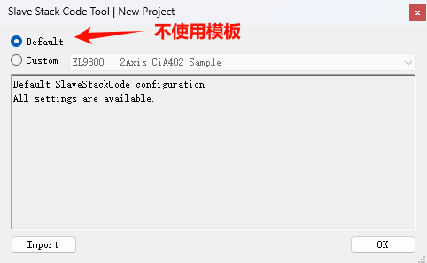
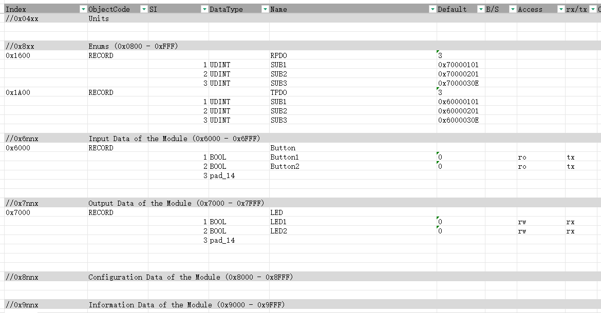
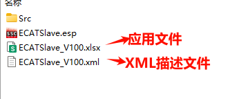
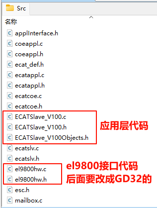

### 简介

- 移植平台：GD32C113CBT6

- 从站芯片：AX58100

- EtherCAT Slave Stack Code Tool (SSC Tool) **V5.12**

  注意：不同SSC Tool版本生成的从站代码，主站兼容性上会有差异，Excel应用文件也不能通用，使用时应确定好版本！

## SSC Tool 使用

### 1、新建工程

如上图所示，有两个选项，**Default**和**Custom**。Default需要自己进行一些配置，Custom则是提供好几个配置模板，这里选择Default。

### 2、配置选项

配置选项的右上方有`Description`说明每个参数的意思，写的很详细，不懂的可以参考。

#### SlaveInformation

这个栏目是配置从站的一些设备信息。

- **VENDOR\_ID**是指从站所使用的ESC芯片的供应商ID，比如AX58100的亚信公司生产的一款EtherCAT从站芯片，所以填的是 `0xB95` 亚信的ID。
- **DEVICE_NAME** 是我们正在开发的ECAT从站产品的名字/型号。

- **VENDOR_IMAGE**、**GROUP_IMAGE**、**DEVICE_IMAGE** 分别是ESC芯片供应商、从站开发团队和从站产品的logo图像数据。logo的格式由描述和默认生成的图像数据的位图信息头可知是16x14、24位的bmp图片。

#### Generic

这个栏目全部保持默认。

主要注意第三个选项 `ESC_SM_WD_SUPPORTED` ，这个选项是选择从站ESC SyncManager Watchdog 是否开启，如果开启，主站需**定期**发送同步信号（如周期性写操作）给从站，如果从站在 **超时时间** 内没有收到RPDO数据，就会触发看门狗，引发 `0x001b`错误。

#### Hardware

| Name             | Value  | 说明                                                         |
| ---------------- | ------ | ------------------------------------------------------------ |
| EL9800_HW        | 1      | 这个选项置1后会生成EL9800(ESC芯片)的硬件接口代码，我们可以在这个文档的基础进行修改，改成我们GD32的 |
| _PIC18           | 0      | 一款EL9800从机评估板，不使用，置0                            |
| _PIC24           | 0      | 一款EL9800从机评估板，不使用，置0                            |
| ESC_16BIT_ACCESS | 1      | 从站MCU访问ESC数据按2字节对齐                                |
| ESC_32BIT_ACCESS | 0      | 从站MCU访问ESC数据按4字节对齐                                |
| MBX_16BIT_ACCESS | 1      | 从站MCU访问ESC的邮箱按2字节对齐                              |
| ......           | ...... | 其他参数保持默认                                             |

- **大多数 EtherCAT ESC要求在 PDO 映射时 要求数据按 2 字节（16 位）对齐**（本地邮箱也是）
- 出现下面的警告是正常的：

#### Application

- 所有应用模板全部设成0，因为后面我们将自己创建和填写excel应用文件。

- Application_FILE 也不需要填，因为这个只有在选择了应用模板，没有添加excel应用文件才会有效，就是告诉SSC应用文件的头文件名字叫什么。如果自己添加了excel应用文件，最后生成的Application_FILE（应用代码文件）就是Excel的名字。

- 不使用从站源码提供的main。

#### Mailbox

因为我只用到了CoE，所以只使能了CoE（CANopen over EtherCAT）。

### 3、创建excel应用文件

### 4、编写excel应用文件

表格只定义了CoE最重要的PDO映射和过程数据区，其余对象由SSC Tool默认生成。PDO映射起始索引同CANopen；过程数据区起始索引由0x2000 -> 0x6000 和 0x7000

| CoE对象字典索引 | 含义               | 说明               |
| --------------- | ------------------ | ------------------ |
| 0x1600          | RPDO Mapping start | T/R 是相对从站而言 |
| 0x1A00          | TPDO Mapping       | T/R 是相对从站而言 |
| 0x6000          | Iuput Data         | 相对主站而言       |
| 0x7000          | Output Data        | 相对主站而言       |

- UDINT：即`uint32_t`，U表示`unsigned`，D表示`double`；SINT：即`int8_t`，S表示`short`
- `pad_14` 表示一个占用 14 位的填充字段，表示剩下的 14 bit 用 pad_14 补足，达到 16 bit（2 字节）对齐

### 5、导入excel并生成从站源码

编写完成后，记得先把刚刚编写的excel应用文件导入到工程，再点击“Project”、“Create new Slave Files”，生成从站源码。

会生成XML描述文件和C语言Src代码，这里我把应用文件、对应的描述文件和Src的应用层代码都统一为“从站名字_版本号”形式，便于后期更新和管理。

