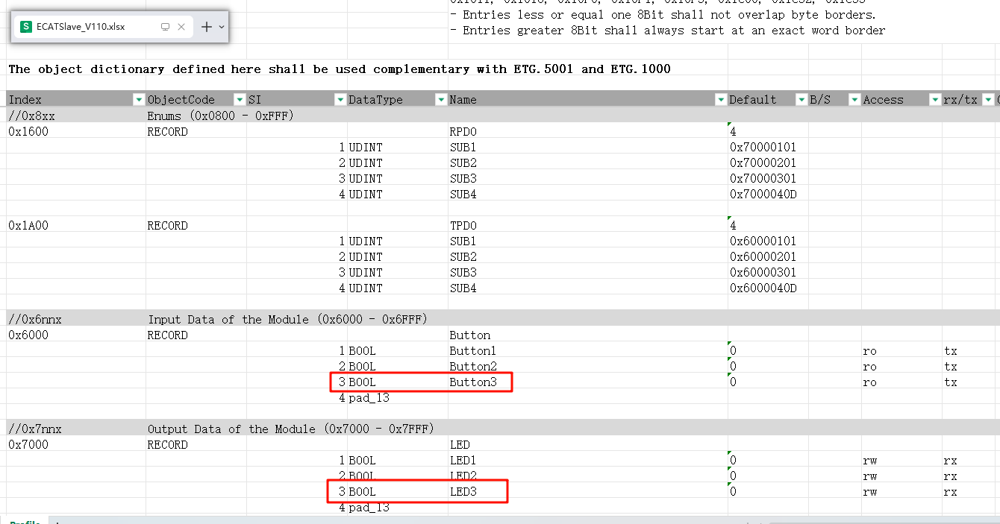
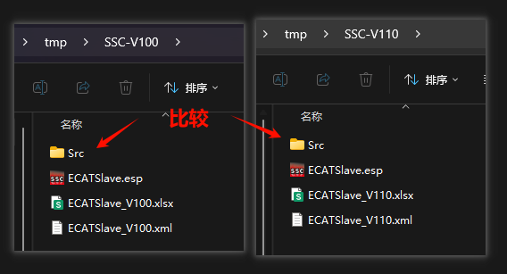
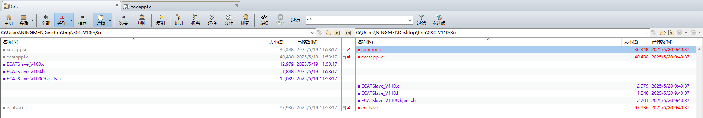
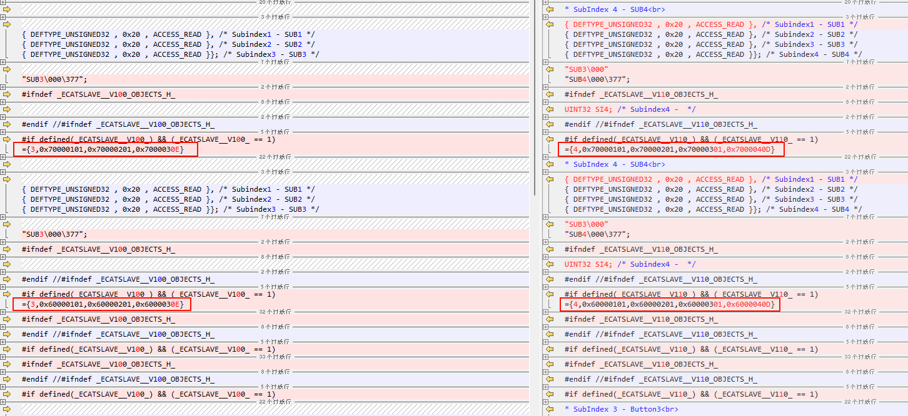

- `ECATSlave_V100.c/h`、`ECATSlave_V100Objects.h`：这三个可以理解为EtherCAT的应用层文件，我们刚刚在excel里面定义的PDO映射和数据区就体现在 `ECATSlave_V100Objects.h`，`ECATSlave_V100.c/h`需要我们定义和添加存放具体数据映射的变量
- `ecat_def.h`：刚刚我们在SSC的配置选项就在这个文件中
- `el9800hw.c/h`：EtherCAT协议栈需要得到的MCU硬件接口，主要是跟ESC的SPI通信和时基的获取，这里我们要把 el9800hw 改成 GD32 的
- 其余可理解为EtherCAT协议栈的中间层文件

## 如果更新应用层文件，哪些源码文件需要对应更新？

在SSC-V100基础上，分别再增加一个LED和Button，版本命名为V110，更新源码，使用Beyond Companies进行对比：

通过实验我们发现：更新Excel后一共有6个文件产生了差异。

其中`coeappl.c`、`coeappl.h`‘、`ecatslv.c`，差异是：`#include "ECATSlave_V100.h"` -> `#include "ECATSlave_V110.h"`，`ECATSlave_V100.c/h` 也差不多，也是由于我们更新了应用文件的命名导致的

`ECATSlave_V100Objects.h` 才是本次更新源码产生变化的有效内容：

